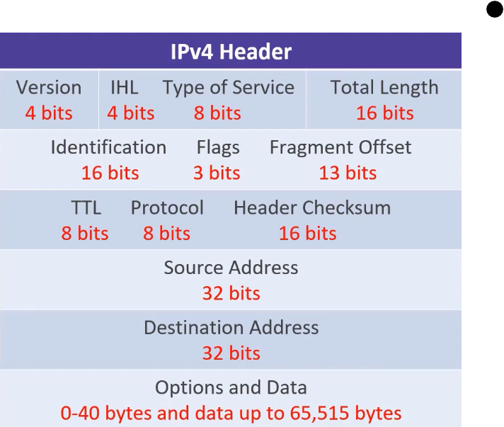

# 04_IPV4 Deep-Dive

[IPV4 Deep-Dive 👉VIDEO &#128279;](https://codered.eccouncil.org/courseVideo/practical-wireshark?lessonId=b7e49894-a4ad-456b-baf3-d6a90111d443&finalAssessment=false)

- Network layer
- Routing and addressing
- Connectionless

**IP Datagram**

- Data
- TCP header
- IP header

**IPv4 Header Size**

