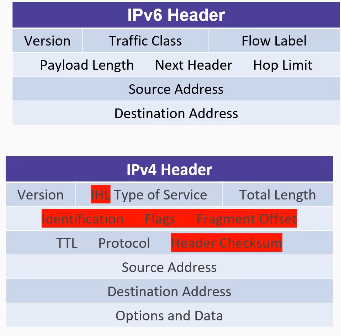
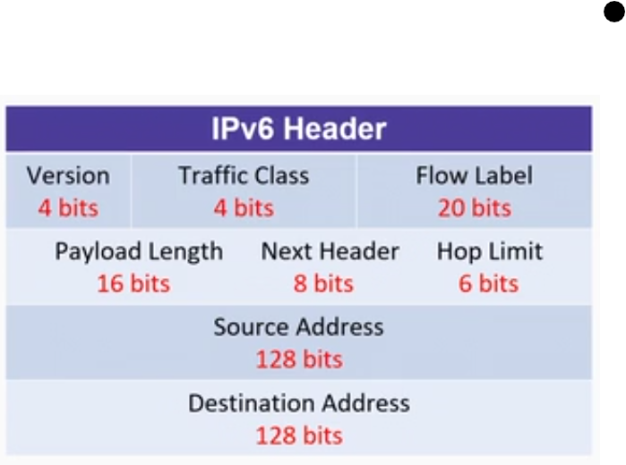

# 05_IPv6 Deep-dive

[IPv6 Deep-dive 👉VIDEO &#128279;](https://codered.eccouncil.org/courseVideo/practical-wireshark?lessonId=0f9e2b1e-b00f-4498-862f-122c79a2edbc&finalAssessment=false)

**IPv6**

- Network layer
- Larger address space
- Connectionless
- No broadcast
- Fewer header values
- Needs ICMPPv6

