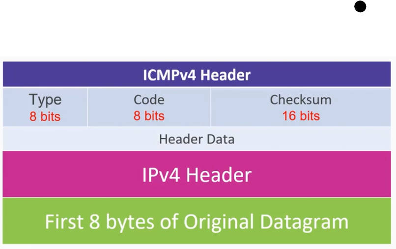
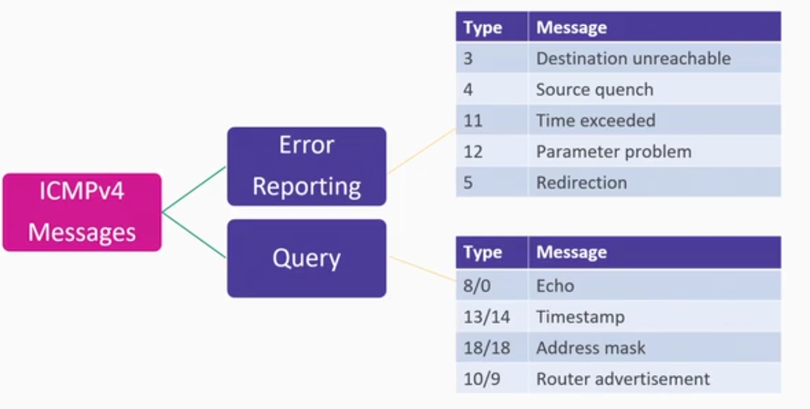

# 06_ICMPv4 Deep-dive

[ICMPv4 Deep-dive 👉VIDEO &#128279;](https://codered.eccouncil.org/courseVideo/practical-wireshark?lessonId=ae590732-8b87-49d2-bcff-d37d89239fe0&finalAssessment=false)

**ICMPv4**

- Network layer
- IP and ICMP
- Notification mechanism

