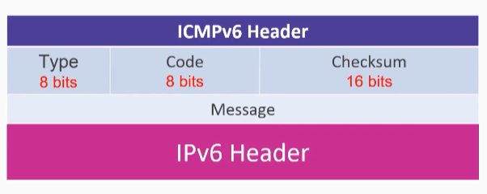
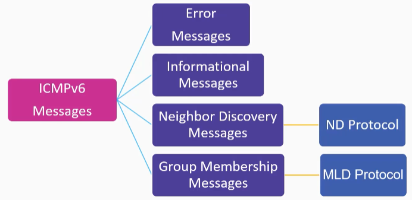
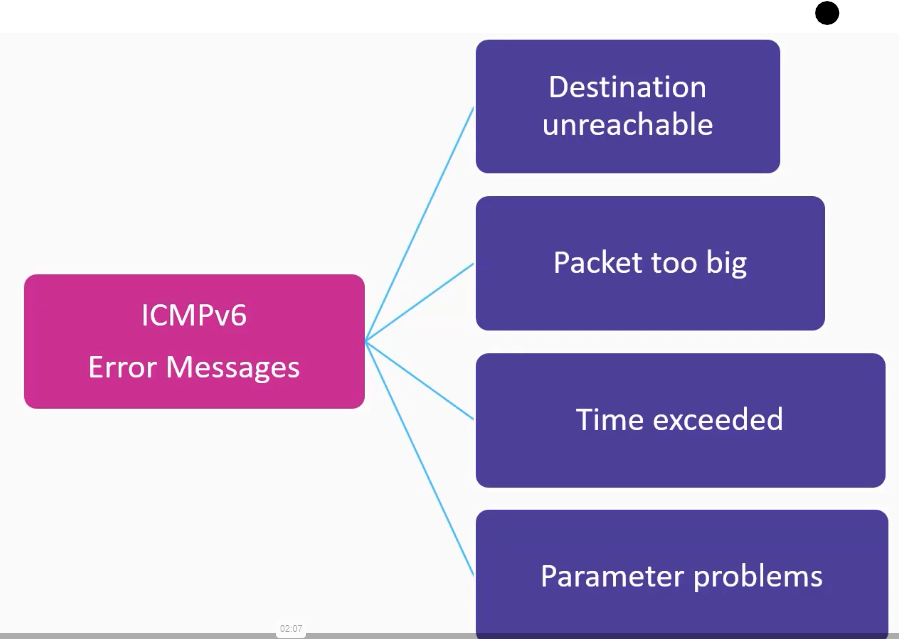
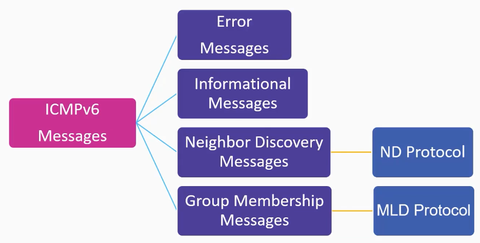

# 07_ICMPv6 Deep-dive

[ICMPv6 Deep-dive 👉VIDEO &#128279;](https://codered.eccouncil.org/courseVideo/practical-wireshark?lessonId=c9787be8-7976-411a-b7e2-4f87c646ecd4&finalAssessment=false)

**ICMP**

- Network layer
- IPv6 and ICMPv6
- Notification mechanism
- No ARP and no IGMP

**ICMPv6 Informational Message**

- Echo request
- Echo reply
