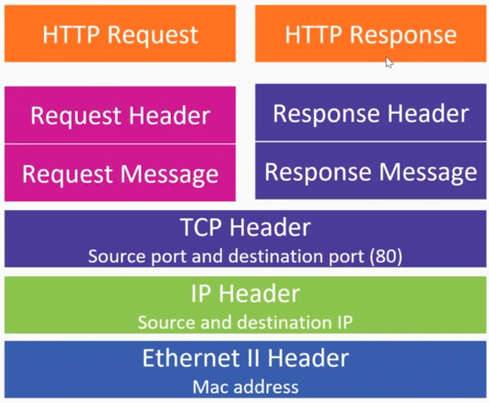
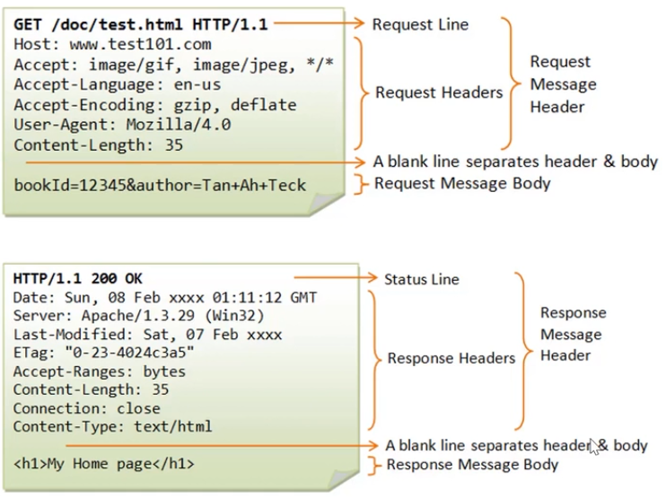
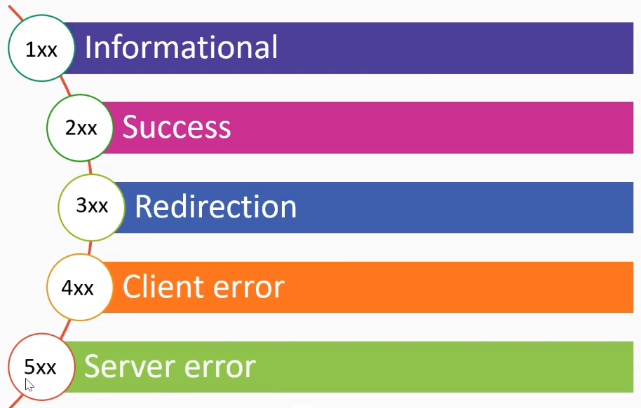

# 01_HTTP_Analysis

[👉VIDEO: HTTP_Analysis &#128279;](https://codered.eccouncil.org/courseVideo/practical-wireshark?lessonId=98e014b5-9457-4214-a52d-cde0163a6a41&finalAssessment=false)

- Application layer
- More than 20 years
- Port 80

### HTTP and the full stack

### Http Request and Response

### HTTP Status Codes

