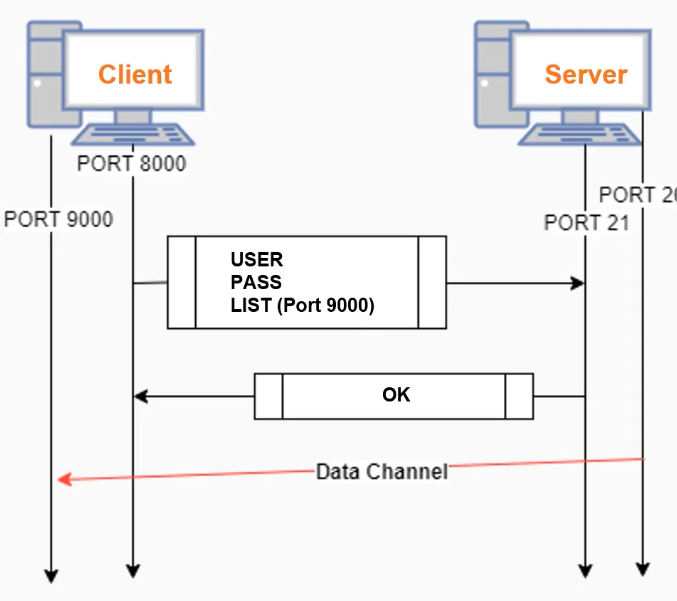
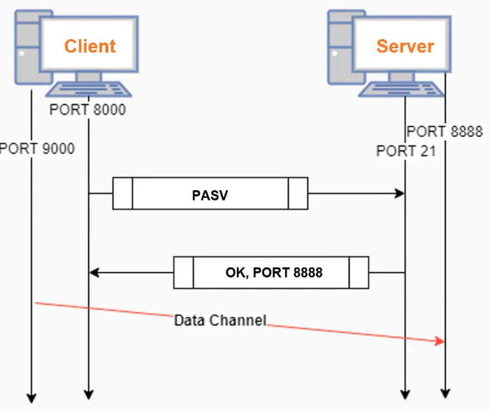
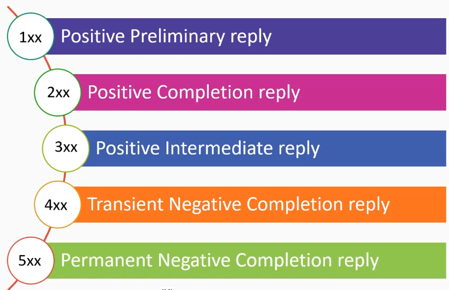

# 01_FTP_Analysis

[👉VIDEO: FTP_Analysis &#128279;](https://codered.eccouncil.org/courseVideo/practical-wireshark?lessonId=8406b666-ff6b-47c6-99df-9b5f53acbee4&finalAssessment=false)

### FTP

- Application layer
- Client-server architecture
- Separate data and control channels
- Two modes of operation (ACTIVE and PASSIVE)
- Maintains session state information
- Unencrypted connection (FTPS versus SFTP)
- Client: Command line, GUI, browser

### Active mode

### Passive mode

### FTP Reply Codes

