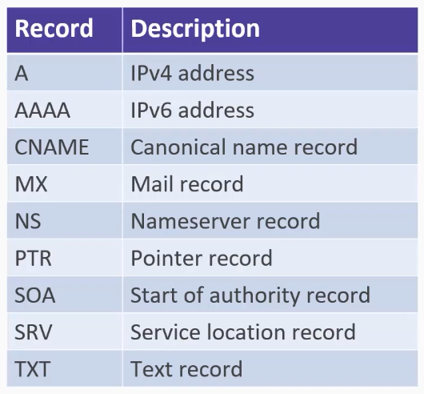
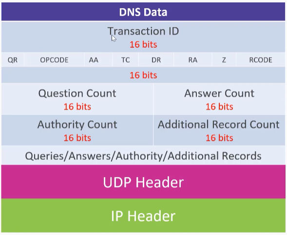
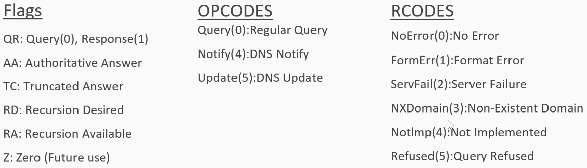

# 03_DNS Analysis

[👉VIDEO: DNS Analysis &#128279;](https://codered.eccouncil.org/courseVideo/practical-wireshark?lessonId=1eb3fd0b-11e1-4f62-87be-4951bfd10699&finalAssessment=false)

### DNS Record Types

### DNS Data

### DNS Packet Explained

