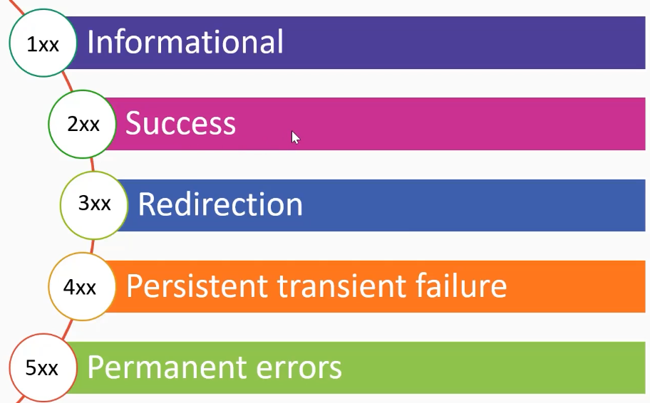

# 05_SMTP Analysis

[👉VIDEO: SMTP Analysis &#128279;](https://codered.eccouncil.org/courseVideo/practical-wireshark?lessonId=2706cb68-82b8-4635-b6b7-c397bb9e9e9b&finalAssessment=false)

### SMTP

- Application layer
- Client-server architecture
- Connection oriented (TCP)
- Mail delivery protocol (push)
- SMTP session commands (MAIL, RCPT, DATA)

### Temp Email

- [Temp Email Address](https://tempail.com/)

### SMTP Response Codes

