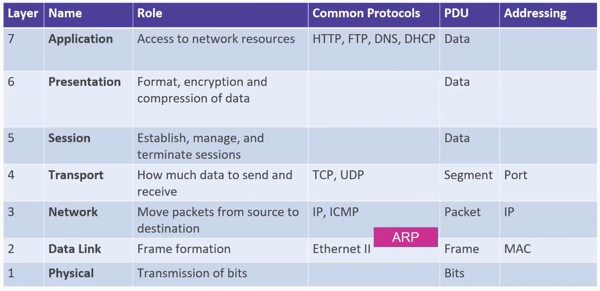
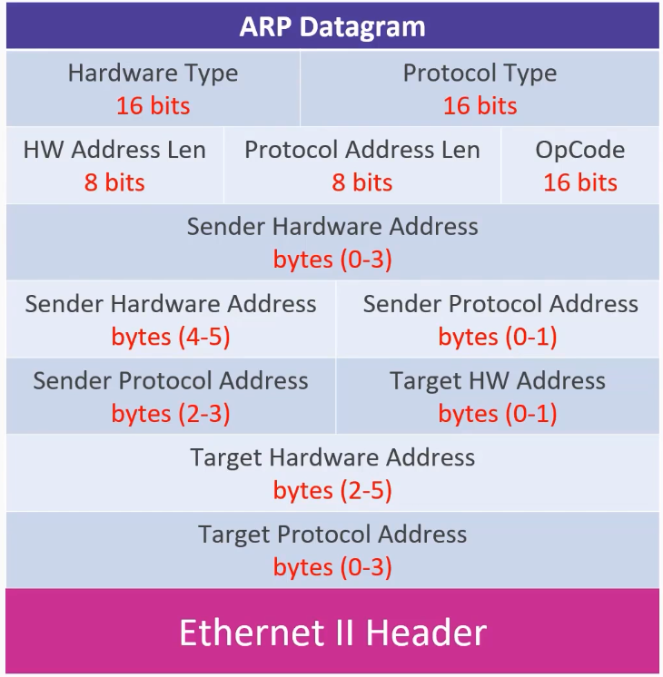
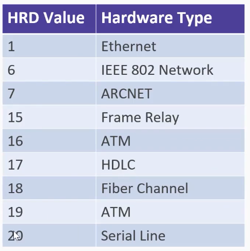
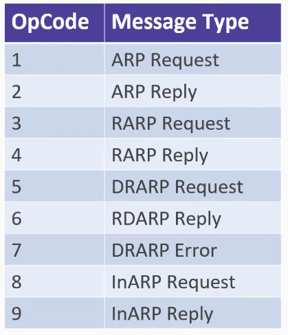

# 06_ARP Analysis

[👉VIDEO: ARP Analysis &#128279;](https://codered.eccouncil.org/courseVideo/practical-wireshark?lessonId=59a8a1e7-4f7b-4a52-87a5-14c627c20496&finalAssessment=false)

### The OSI Model

### ARP Datagram

### ARP Hardware Types

### ARP Operations

